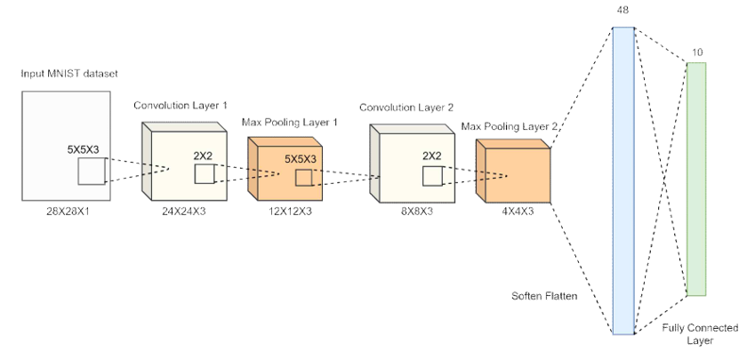
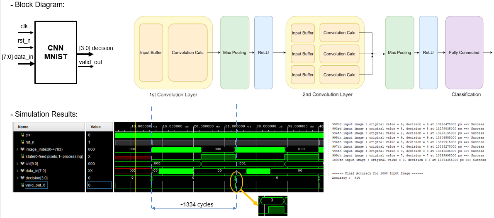
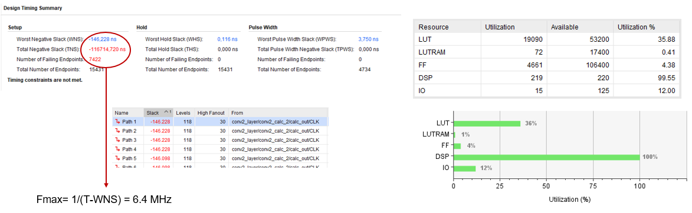
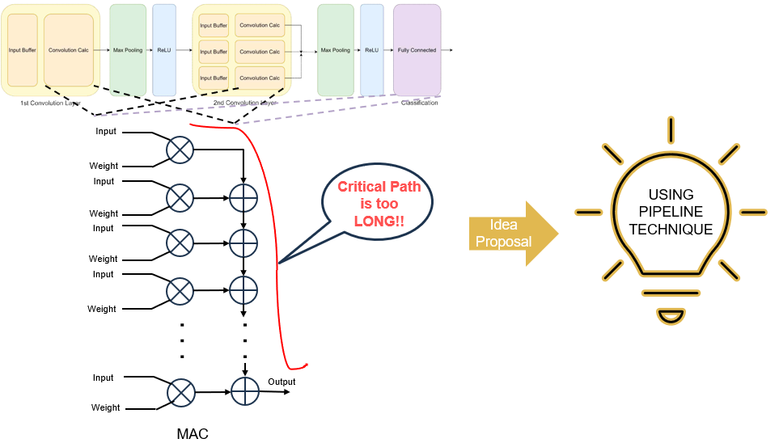
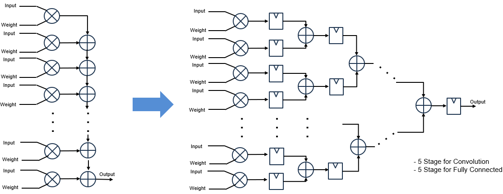
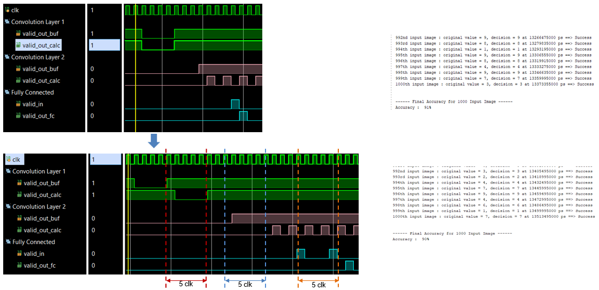
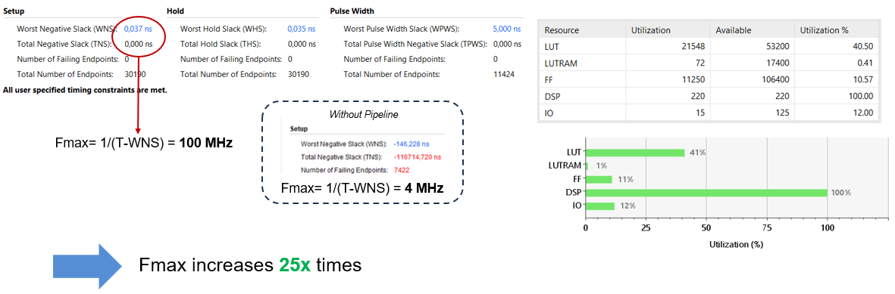

*old project uploaded recently*

# pipelined-cnn-mnist-accelerator
Pipelined CNN hardware accelerator in Verilog with 25× throughput improvement.

The baseline was adapted from: https://github.com/boaaaang/CNN-Implementation-in-Verilog

- 8-bit fixed point integer (Q1.7)
- Number of parameters: 796
- Dataset: MNIST
- Accuracy: 96%

## Block Diagram and Simulation Results

## Implementation Results

- Target board: PYNQ-Z2
- Using Vivado

## Proposed Idea

## Pipeline Architecture

## Simulation after pipeline
- Processing: 1334 cycles -> 1349 cycles

## Implementation after pipeline

